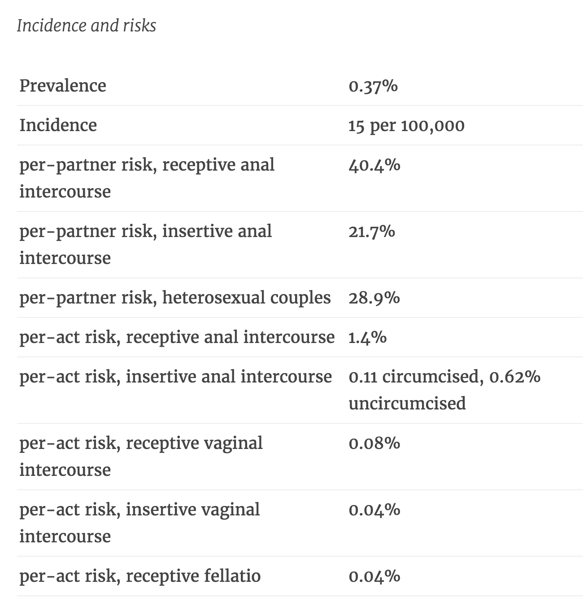

_(Эпистемический статус: быстрый подсчёт, вынесенный из [чата рационалистов](http://lesswrong.ru/slack). Все количественные оценки следует читать как грубые [вычисления Ферми](https://en.wikipedia.org/wiki/Fermi_problem), а не как подсчёт истинных значений.)_

_(Осторожно: пересчёты человеческой жизни на деньги; рационализм; и помните, что я не врач и не эксперт в обсуждаемых темах.)_

Стоит ли заниматься сексом с незнакомым партнёром, не получив справку? Насколько это рискованно? В каких единицах это вообще можно измерять?

**I.**

Давайте сначала пройдёмся по венерическим заболеваниям в целом. Они условно делятся на:

- те, которые не лечатся, но относительно безвредны
- те, которые вредны, но легко лечатся
- ВИЧ

Начнём с самых безвредных. Орального герпеса опасаться странно: он есть у [половины населения](https://ru.wikipedia.org/wiki/%D0%9F%D1%80%D0%BE%D1%81%D1%82%D0%BE%D0%B9_%D0%B3%D0%B5%D1%80%D0%BF%D0%B5%D1%81#.D0.AD.D0.BF.D0.B8.D0.B4.D0.B5.D0.BC.D0.B8.D0.BE.D0.BB.D0.BE.D0.B3.D0.B8.D1.8F), а ещё наличие у вас орального герпеса [частично защищает](http://www.herpes.com/hsv1-2.html) от генитального. \[1]

Генитальный герпес проблемнее, первое проявление может вызвать редкие [осложнения](http://www.webmd.com/genital-herpes/tc/other-health-problems-caused-by-herpes-simplex-virus-topic-overview), он существенно более стигматизирован, более пугает вас и отпугивает потенциальных партнёров.

[ВПЧ](https://ru.wikipedia.org/wiki/%D0%9F%D0%B0%D0%BF%D0%B8%D0%BB%D0%BB%D0%BE%D0%BC%D0%B0%D0%B2%D0%B8%D1%80%D1%83%D1%81%D1%8B_%D1%87%D0%B5%D0%BB%D0%BE%D0%B2%D0%B5%D0%BA%D0%B0) ещё страннее: несколько десятков разновидностей, часть из которых вызывают рак, в основном шейки матки, но при этом никак иначе не проявляются, а часть безвредна, но прорастает кондиломами и бородавками. (Кажется, бывают и такие, которые совмещают оба симптома.) Ещё страннее, что толкового теста на ВПЧ для мужчин не существует, поэтому справку вы всё равно не получите и партнёру не предъявите.

ВПЧ не лечится, но при здоровой иммунной системе рано или поздно проходит сам. В последние годы появились [работающие вакцины](https://ru.wikipedia.org/wiki/%D0%92%D0%B0%D0%BA%D1%86%D0%B8%D0%BD%D0%B0_%D0%BF%D1%80%D0%BE%D1%82%D0%B8%D0%B2_%D0%B2%D0%B8%D1%80%D1%83%D1%81%D0%B0_%D0%BF%D0%B0%D0%BF%D0%B8%D0%BB%D0%BB%D0%BE%D0%BC%D1%8B_%D1%87%D0%B5%D0%BB%D0%BE%D0%B2%D0%B5%D0%BA%D0%B0), которые постепенно рекомендуют всем в возрасте до 25 лет.

Из вредных, но излечимых заболеваний, гонорея, хламидия и прочее — не особо страшные болезни по сравнению с ВИЧ, заражаешься-замечаешь-пьёшь антибиотики-здоров. Стигма на них в первую очередь потому, что они ааа о ужас венерические.

В общем, из относительно серьёзных рисков остаются только:

- ВИЧ.
- Генитальный герпес (в плане качества жизни, а не здоровья), потому что даже если ты убедишь себя, что про него можно не париться, он всё равно будет парить твоих партнёров.
- Не заметить болячку или забояться идти к врачу и сильно запустить ситуацию, особенно с сифилисом, от которого могут быть совсем плохие последствия.

Если вы хотите больше чисел и данных про венерические заболевания в целом — про частоту, про риски заражения от одного полового акта, про первые признаки — читайте замечательный [STD Statistics](https://srconstantin.wordpress.com/2015/04/30/std-statistics/) от Sarah Constantin.

Из всего перечисленного самой серьёзной причиной для беспокойства является, понятное дело, ВИЧ. Давайте оценим это беспокойство количественно.

**II.**

_(Выкладки ниже рассчитаны на риски при вагинальном сексе. Для анального секса риски становятся намного выше, см. таблицу ниже по тексту.)_

Во-первых, про оральный секс: «[The per-act risk of receptive fellatio is 0-0.04%](https://srconstantin.wordpress.com/2015/04/30/std-statistics/)» и «[There is no transmission risks for receiving oral sex](http://sfaf.org/hiv-info/basics/can-i-get-hiv-from-oral.html)». При поцелуях рисков нет вообще, если только у вас и у вашего партнёра нет во рту зияющих кровавых дыр.

Про вагинальный секс, риски для мужчины: «[per-act risk, insertive vaginal intercourse 0.04%](https://srconstantin.wordpress.com/2015/04/30/std-statistics/)» \[2]. Это значение без защиты. Для женщин вдвое больше, 0.08%. Умножаем на condom effectiveness, «reduces risk by 80%». Получаем 1/2500 \* 1/5 = 1/12500 для мужчин и 1/6250 для женщин.

То есть, если вы принимаете решение, заниматься ли защищённым вагинальным сексом с партнёром/партнёршей, про которого точно знаете его/её ВИЧ+ статус, то:

- если предположить, что вы цените свою жизнь в $100000/год (много? мало? различные американские правильтельственные агентства присваивают человеческой жизни ценность [в $6-10M долларов](http://www.nytimes.com/2011/02/17/business/economy/17regulation.html) \[3])
- если оценить ожидаемую продолжительность вашей оставшейся жизни как 50 лет
- если предположить, что ВИЧ+ статус снижает качество жизни вдвое \[4]

То получаем: $100000 * 50 / 2 / 12500 = $200, если вы мужчина, и $400, если вы женщина. То есть вам должно хотеться заняться сексом настолько, что вы будете готовы сжечь $200 или \$400 ради одного полового акта.

(Напоминаю: с заведомо ВИЧ+ партнёром; при условии, что вы цените свою жизнь в $100000/год; при условии, что ВИЧ-статус правда вам так сильно испортит жизнь. Вообще [ВААРТ](https://ru.wikipedia.org/wiki/Высокоактивная_антиретровирусная_терапия) стоит от [100 тысяч до миллиона рублей в год](http://www.lsgeotar.ru/farmakoekonomicheskiye-aspekti-terapii-virusa-immunodefitsita.html), что существенно меньше, чем $100000 \* 0.5, и в России оплачивается государством.)

---

Осталось оценить вероятность того, что случайный человек окажется ВИЧ+, если вы живёте в России. Например, в Москве.

Тут, к сожалению, всё оказалось сложнее, и мне не до конца понятно, кому верить.

Со слов [Вадима Покровского](http://kommersant.ru/doc/2725981), руководителя Федерального научно-методического центра по профилактике и борьбе со СПИД:

<blockquote>«Также он добавил, что сейчас официально у нас ВИЧ-инфицировано 3% мужчин в возрасте от 30 до 34 лет. При этом, по его словам, на деле где-то 5-6%, поскольку не все случаи выявлены, и не все носители знают, что они больны.»</blockquote>

<blockquote>«...в массовом сознании существует такой миф, что ВИЧ-позитивные — это либо наркоманы, либо гомосексуалисты, но на самом деле это не так. В прошлом году среди лиц, у которых была выявлена ВИЧ-инфекция, 57% действительно употребляли наркотики инъекционным путем, 1% — это люди, которые заразились при гомосексуальных контактах, а вот 40% с лишним — это совершенно обычные люди, гетеросексуальной ориентации, которые просто не придавали значения средствам предохранения при занятиях сексом.»
</blockquote>

[И другая статья](http://www.rbc.ru/society/20/01/2016/569fa9849a794768bb441afa):

<blockquote>«В 2015 году примерно 53% случаев связаны с употреблением наркотиков, 43% — с половыми контактами между мужчинами и женщинами, 1,5% — с гомосексуальными контактами.»

«...по экспертным данным, уже в настоящее время носителями ВИЧ в России могут быть до 1,5 млн человек.»</blockquote>

Меня тут удивляет доля заражённых посредством гетеросексуальных контактов по сравнению с передачей инфекции через шприцы и гомосексуальные контакты. В США [всё не так](https://www.cdc.gov/hiv/group/msm/):

<blockquote>«In 2014: Gay and bisexual men accounted for 83% (29,418) of the estimated new HIV diagnoses among all males aged 13 and older and 67% of the total estimated new diagnoses in the United States.»</blockquote>

Почему? Потому что риски заразиться при анальном сексе в десятки раз выше для принимающей стороны и в разы выше для выдающей, чем при вагинальном:

Ну и культурные отличия тоже влияют.

То ли наши врачи считать не умеют, то ли россияне предохраняться не умеют, то ли у нас геев намного меньше или у них совсем иная культура? Выглядит довольно странно.

Ещё одна проблема — что сложно оценить распределение по регионам. Из пересказа выше слов Покровского:

<blockquote>«самая сложная ситуация в Иркутской области, в Свердловской, в Самарской, в Кемеровской — там по статистике больше всего ВИЧ-инфицированных, отдельно упомянул Тольятти.»
</blockquote>

Но [при этом](https://ru.wikipedia.org/wiki/%D0%AD%D0%BF%D0%B8%D0%B4%D0%B5%D0%BC%D0%B8%D0%BE%D0%BB%D0%BE%D0%B3%D0%B8%D1%8F_%D0%92%D0%98%D0%A7-%D0%B8%D0%BD%D1%84%D0%B5%D0%BA%D1%86%D0%B8%D0%B8#.D0.A1.D1.82.D0.B0.D1.82.D0.B8.D1.81.D1.82.D0.B8.D0.BA.D0.B0_.D0.B7.D0.B0.D0.B1.D0.BE.D0.BB.D0.B5.D0.B2.D0.B0.D0.B5.D0.BC.D0.BE.D1.81.D1.82.D0.B8_.D0.B8_.D1.81.D0.BC.D0.B5.D1.80.D1.82.D0.BD.D0.BE.D1.81.D1.82.D0.B8_.D0.BF.D0.BE_.D0.A0.D0.BE.D1.81.D1.81.D0.B8.D0.B8):

<blockquote>«Также Роспотребнадзор в своих информационных материалах специально указывает на отсутствие достоверных данных по Москве»</blockquote>

Так что сколь-либо сложную модель построить не получается. Модель выглядела бы как:

Base rate probability\*\*\* (вероятность отсутствия диагноза или что партнёрша обманет про свой статус) _\* _(всякие дополнительные поправки про социальные слои, регионы, бисексуальность партнёра или склонность партнёрши заниматься сексом с би-мужчинами, шансы прошлых половых контактов с наркоманами)

Но я понятия не имею, как оценить все эти параметры, кроме base rate, который получается 1%. Со всем остальным неразбериха:

1. На возрастную группу 30-34 (и, вероятно, более широко — 18-34) явно приходится большая часть случаев, вероятность повышается.
2. Если вы не в Иркутской, Свердловской, Самарской и Кемеровской областях, вероятность понижается (если там больше заражённых, то на Москву останется меньшее число).
3. Городское население явно включает больше ВИЧ+, вероятность повышается.
4. «...[infections are most prevalent](https://en.wikipedia.org/wiki/HIV/AIDS_in_Russia) among males aged 30–34, out of which 3% are infected. Infection rate among females in the same age range reaches 1.5%», вроде как среди женщин заражённых меньше, чем среди мужчин, вероятность понижается, если вы мужчина, и повышается, если вы женщина.
5. Если ваше пребывание в более интеллектуальных кругах означает большую толерантность потенциальных партнёров к би-мужчинам, вероятность повышается.
6. Если вы считаете окружающих людей более ответственными, чем в среднем, более вероятно проверяющимися на венерические заболевания, вероятность понижается.
7. ...и так далее.

Параметры про городское население и про возрастную группу кажутся мне самыми значимыми, поэтому давайте просто остановимся на 3% для всех. (На самом деле для женщин опять риски чуть больше, для мужчин чуть меньше.)

$200 за один защищённый половой акт с ВИЧ+ партнёршей -> $6 за один защищённый половой акт с женщиной, у которой с вероятностью 3% есть ВИЧ-инфекция. Или \$12 для женщин за один защищённый половой акт с мужчиной.

**III.**

Оценка в долларах получилась какая-то неубедительная и неинтуитивная. Давайте лучше посчитаем в [микромортах](https://ru.wikipedia.org/wiki/%D0%9C%D0%B8%D0%BA%D1%80%D0%BE%D0%BC%D0%BE%D1%80%D1%82).

Один микроморт — это единица, равная одной миллионной части вероятности смерти.

50% штраф к качеству жизни — это 0.5 морта, 500000 микромортов. 500000 / 12500 = 40 микромортов (за защищённый вагинальный секс с ВИЧ+ партнёршей). Или примерно 5 прыжков с парашютом. Для женщин вдвое больше, 80 микромортов.

Если делим на 100/3 для партнёра с неизвестным статусом, то получаем 1.2 (или 2.4 микроморта для женщин) — примерно как выкурить полторы (три) сигареты или пройти 30 (60) километров пешком.

(Кстати, сколько стоит один микроморт? Если мы примем стоимость оставшейся жизни в $5000000, то 1 микроморт = $5.)

**IV.**

Подобные количественные модели хороши тем, что, опираясь на них, уже можно аргументированно рассуждать.

Не согласны с моей оценкой стоимости жизни? Предложите другие значения.

Считаете, что я где-то ошибся в процитированных рисках? Покажите другие исследования или постройте аргумент, почему риски стоит увеличить или уменьшить, и _во сколько раз_.

Не согласны со структурой модели? Предложите свои поправки: неучтённые параметры или соотношения. Может быть, вы цените годы жизни в молодости больше, чем годы жизни в старости, например?

Но в любом случае, если эти оценки не соответствуют вашей интуиции (в ту или иную сторону), вам придётся противопоставить им что-то более структурированное, чем «а мне кажется, что всё же это слишком опасно» или «да ну, это маловероятно». И таким образом, посредством анализа отдельных составляющих общей картины, мы надёжнее приблизимся к пониманию мира, чем через тезисы о ситуации в целом.

---

\[1] Технически не «оральный» и «генитальный», а [HSV-1 и HSV-2](http://www.herpes.com/hsv1-2.html), каждый из которых может прижиться и на губах, и на гениталиях, но корреляция между типом вируса и местом заражения довольно высока.

\[2] Я подозреваю, что шанс заразиться для России выше, чем в США, потому что в США более распространена практика обрезания, но у меня нет под рукой статистики.

\[3] Вы можете ценить свою жизнь больше или меньше, но выберите какое-нибудь число, которое вам кажется правдоподобным. В любом случае, далее по тексту я перейду от долларов к микромортам, и станет менее спорно.

\[4] WHO [оценивает](http://who.int/healthinfo/global_burden_disease/GBD2004_DisabilityWeights.pdf) качество жизни с ВИЧ как 0.5 от жизни без нарушений дееспособности, если человек не получает [антиретровирусной терапии](https://ru.wikipedia.org/wiki/%D0%92%D1%8B%D1%81%D0%BE%D0%BA%D0%BE%D0%B0%D0%BA%D1%82%D0%B8%D0%B2%D0%BD%D0%B0%D1%8F_%D0%B0%D0%BD%D1%82%D0%B8%D1%80%D0%B5%D1%82%D1%80%D0%BE%D0%B2%D0%B8%D1%80%D1%83%D1%81%D0%BD%D0%B0%D1%8F_%D1%82%D0%B5%D1%80%D0%B0%D0%BF%D0%B8%D1%8F), и как 0.9, если получает. См. также: [Doing Good Better](https://www.amazon.com/Doing-Good-Better-Effective-Altruism/dp/1592409660), глава 2, про оценки [QALY](https://en.wikipedia.org/wiki/Quality-adjusted_life_year).
