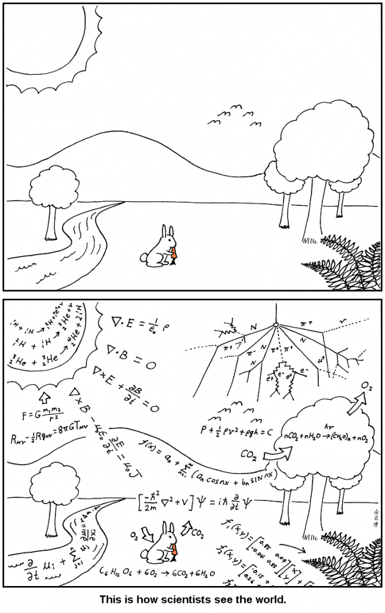

Если этот текст попал в запланированную аудиторию, то вас скорее всего не нужно убеждать, что научные исследования и создаваемые с их помощью технологии — это крутой мощный инструмент и вообще наше всё, причина существования цивилизации в том виде, как она нам известна. Вероятно, вы когда-то задумывались, как здорово было бы организовать свою жизнь с помощью количественного и проверенного экспериментами подхода.

Не можете разрешить спор с кем-то, например, написать на большой красной кнопке на сайте «покупайте наши спички» или «купить наши спички»? Договариваетесь об условиях эксперимента, проводите A/B тестирование, анализируете результат, выясняете, кто был прав. Хотите оптимизировать питание? Сдаёте кучу анализов, проходите генетическое тестирование, прогоняете всё это через продуманную статистическую модель и получаете оптимальный ответ. Даже если вы не знаете всё наверняка, у нас же есть теория вероятностей, байесианство, мощный инструментарий для принятия решений в условиях неопределённости. Надо только всё это освоить.

Вы задумываетесь об этом, мечтаете и приходите к выводу: я недостаточно изучил статистику и подход к организации полноценных исследований сейчас, но дорасту до этого уровня крутизны позже. А пока надо учиться и разобраться подробнее. Вы начинаете читать про науку и статистику и узнаёте, что вам надо уметь отличать корреляцию от причинности, помнить о важности размера выборки, не попасться на удочку [p-hacking](https://en.wikipedia.org/wiki/Data_dredging)'а, отмечаете себе, что нужно освоить R, SciPy или [Stan](http://mc-stan.org/), прочитать «[Probability Theory: Logic of Science](http://bayes.wustl.edu/etj/prob/book.pdf)» Джейнса, разобраться с обучением нейросетей или хотя бы наловчиться в линейной регрессии. Кроличья нора глубока, вы только в начале пути, вам ещё рано применять методы рациональности всерьёз.

Когда вы вступаете в обсуждения вида «а правда ли ложиться спать вовремя важнее, чем просыпаться вовремя?», вы вспоминаете про добродетель научного подхода и говорите «ок, мы могли бы это протестировать?», и начинаете рассуждать об эксперименте, который бы это выявил. Вы идёте на PubMed, Google Scholar и Sci-Hub за данными. Правда, отдельным исследованиям доверять нельзя, и вы ищете метаисследования. Чуть позже вы узнаёте, что метаисследования тоже не все одинаково хороши, а ещё иногда вы находите несколько метаисследований сразу, которые друг другу противоречат, а ваш оппонент тем временем возражает про генетическую вариативность и прочие усложняющие ситуацию обстоятельства. Цикл замыкается: вам нужно найти ответ в условиях неопределённости, но инструменты для _настоящего_ выявления ответа всегда маячат где-то на горизонте. Вы вздыхаете, говорите «ок, в теории можно было бы выяснить, кто прав, проведя вот такой эксперимент, но я сейчас точно не осилю это реализовать» и возвращаетесь в свой реальный мир.

В реальном мире царят привычки и эвристики. В реальном мире люди редко вспоминают про химию, чтобы приготовить себе ужин повкуснее, и про статистику, когда решают, пойти ли ночью домой по тёмному переулку или освещённой улице.

Наука остаётся чем-то далёким и малодоступным (если это не упакованные заранее блага цивилизации), а реальность тут, сейчас, и совершенно непонятно, как всё это знание про вероятности и психологию может помочь, когда приходит время решить, идти сегодня в кино с друзьями или остаться дома и почитать книжку. И вот вы откатываетесь с глобальных амбиций по мировой оптимизации на эвристику аффекта - «вау, кино с моим любимым актёром, точно надо идти!», или на экстраполяцию по одному свидетельству типа «Вася сходил и сказал, что ему не понравилось».

Если только вы не настоящий рационалист, конечно. Для настоящего прикладного рационалиста между этими двумя мирами нет зияющей пропасти. Но вовсе не потому, что у него формальная статистика царит повсюду и всё выражено явными статистическими моделями. Скорее наоборот: потому что он понимает, что границы нет, что оба мира — две крайних точки на длинном спектре компромисса между точностью и дешевизной, что сложность модели можно подбирать по ситуации, и что при этом простые модели могут приносить много пользы. И в этом нет ничего постыдного.

Насколько часто мне нравятся фильмы, в которых есть актёр, который мне очень нравится? Как часто совпадают вкусы у меня и Васи? Насколько мне важно прочитать эту книгу, и насколько мне важно сделать это сегодня? В прошлом, когда я решал пойти в кино вместе с этими людьми, как часто я бывал доволен принятым решением в итоге?

Вы можете научиться видеть мир так (и аналогично для психологии; и социологии; и экономики):

...но это не обязывает обсчитывать весь мир по формулам от первых принципов. Если вы округлите пи до 3, а число секунд в сутках до 100000, ничего страшного не случится.

Настоящая прикладная рациональность начинается не из умения более аккуратно считать. Настоящая повседневная рациональность — в способности увидеть в этом минимальное ядро, задать себе правильные вопросы с примерными ответами, упростить и округлить настолько, насколько возможно, и за несколько простых операций извлечь 80% от оптимума. Или 50%, если максимальная выгода всё равно невелика. Или 95%, если вы внедряете себе в жизнь рутину, которую будете повторять ежедневно на протяжении многих лет.

Кроличья нора в самом деле глубока, но воображаемый читатель из первой половины этого текста ошибается в том, куда она ведёт, и где-то свернул не туда. Хорошие новости: уметь интегрировать не понадобится (хотя иметь интуицию о матанализе всё же полезно). Плохие новости: легче от этого не станет, потому что ответы на вопросы и хорошие решения придётся находить в реальности, а не в теоретическом воображаемом мире, где у вас есть неограниченное количество времени и данных для анализа.

В следующих сериях: как начать замечать окружающую вас реальность; как не попасть в бесконечную рекурсию; и почему любопытство — главная добродетель рационалиста.
